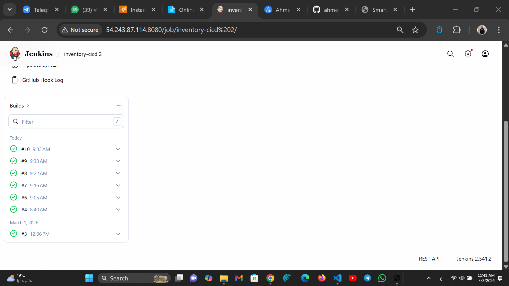
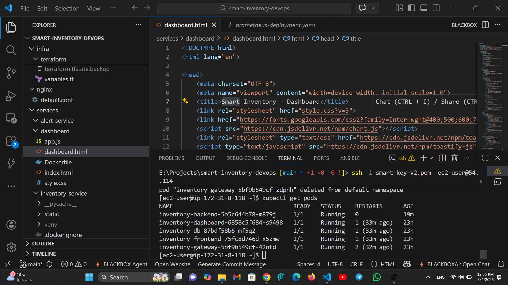
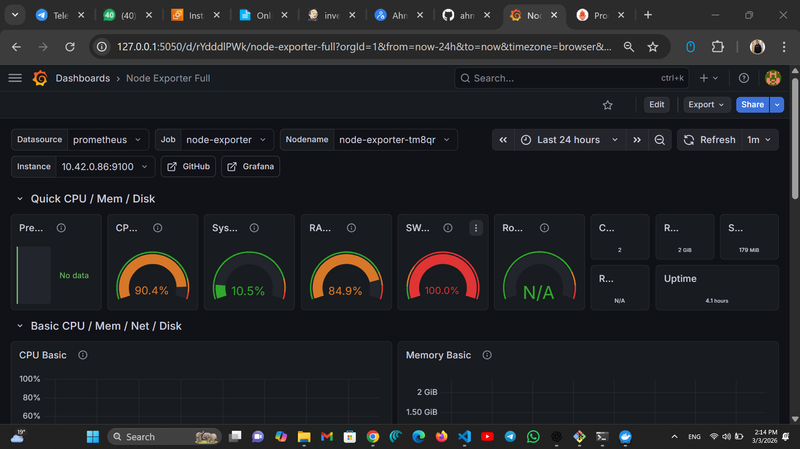
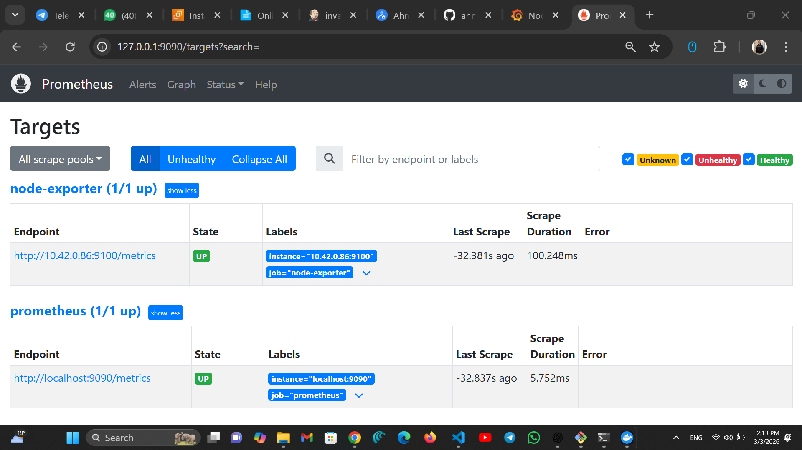
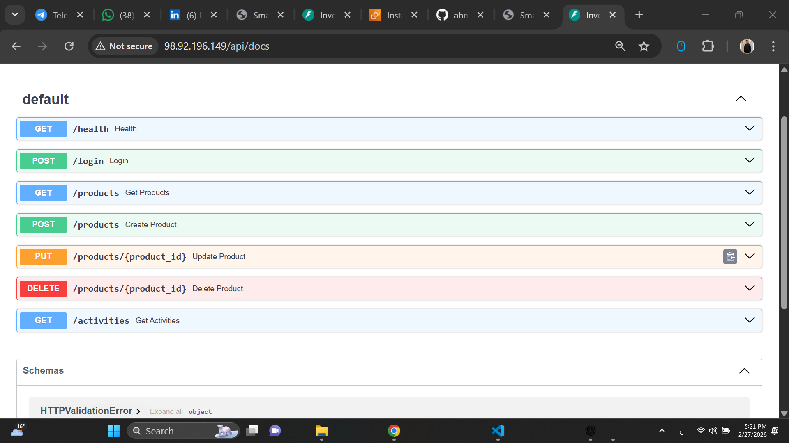

# 🚀 Smart Inventory Dashboard (DevOps Edition)

A **production-ready inventory management system** designed to demonstrate modern **DevOps practices** including CI/CD automation, containerization, Kubernetes deployment, infrastructure as code, and monitoring.

---

# 🏷 DevOps Stack

---

# 📑 Table of Contents

- [Architecture](#architecture)
- [Features](#features)
- [Dashboard](#dashboard)
- [CI/CD Pipeline](#cicd-pipeline)
- [Kubernetes Deployment](#kubernetes-deployment)
- [Monitoring](#monitoring)
- [API Documentation](#api-documentation)
- [Tech Stack](#tech-stack)
- [Setup & Running](#setup--running)
- [Credentials](#credentials)
- [API Endpoints](#api-endpoints)

---

# 🏗 Architecture

This project demonstrates a **complete DevOps workflow**:

Developer → GitHub → Jenkins CI/CD → Docker → Kubernetes → Monitoring → Users

Infrastructure is provisioned using **Terraform** and configured using **Ansible**.

---

# ✨ Features

## 🚀 DevOps & System

- Health Check API (`/health`)
- Environment Awareness (Local / Staging / Production)
- Activity Logging
- API Failure Handling
- Infrastructure Automation

---

## 📊 Dashboard

- Real-time inventory statistics
- Interactive charts using **Chart.js**
- Dark mode UI
- Responsive layout
- Glassmorphism design

---

## ⚙️ CI/CD Pipeline

Pipeline stages:

1️⃣ Pull code from GitHub  
2️⃣ Build Docker images  
3️⃣ Push images to registry  
4️⃣ Deploy to Kubernetes  

---

## ☸ Kubernetes Deployment

Services run inside Kubernetes pods to ensure:

- Scalability
- Fault tolerance
- High availability

---

# 📊 Monitoring

## Grafana Dashboard

Grafana visualizes metrics collected by Prometheus.

---

## Prometheus Targets

Prometheus monitors system health, containers, and services.

---

# 📘 API Documentation

FastAPI automatically generates interactive **Swagger documentation**.

---

# 🧰 Tech Stack

### Backend
- Python
- FastAPI

### Frontend
- HTML
- CSS
- JavaScript

### DevOps
- Docker
- Kubernetes
- Jenkins
- Terraform
- Ansible
- AWS EC2
- Prometheus
- Grafana
- Nginx

---

# 🧱 Project Structure

