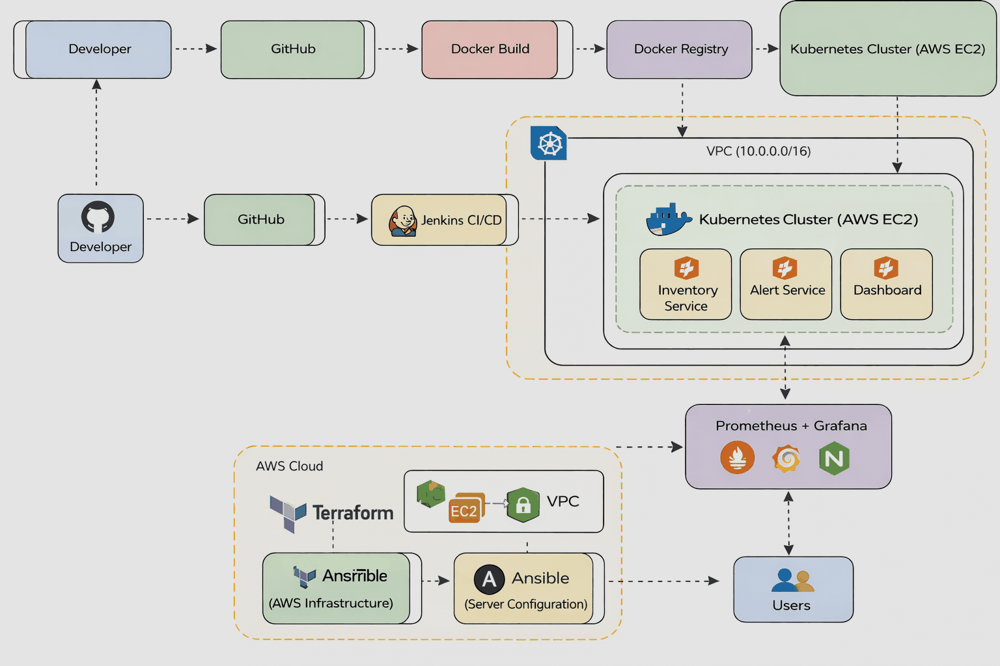
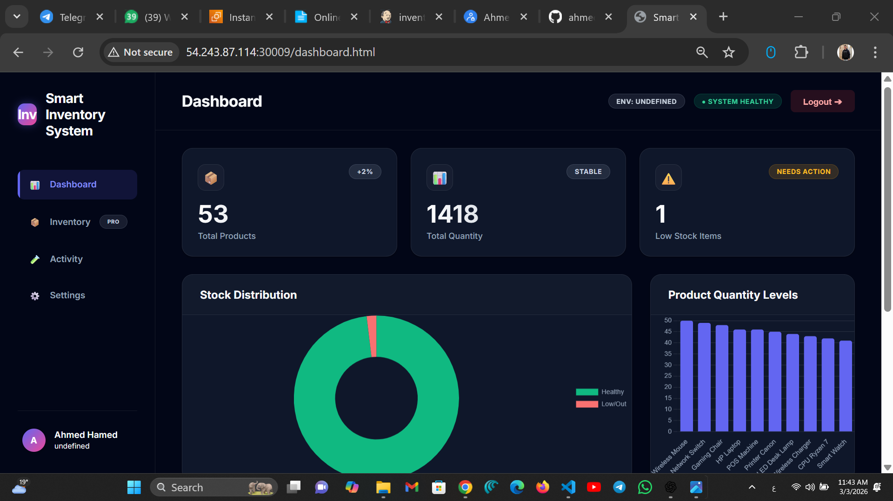

# Smart Inventory Dashboard (DevOps Edition)

A professional, production-ready inventory management system designed for DevOps portfolios. This project demonstrates clean architecture, RESTful API integration, and modern frontend practices without the complexity of heavy build tools.

---

# 🏗 DevOps Architecture



---

# 🏷 DevOps Stack


---

# 📊 Dashboard



---

# ⚙️ CI/CD Pipeline


---

# ☸ Kubernetes Deployment


---

# 📊 Monitoring

## Grafana Dashboard


## Prometheus Targets


---

# 📘 API Documentation


---

# Features

### 🚀 DevOps & System

- **Health Check API**: `/health` endpoint for monitoring system status.
- **Environment Awareness**: Visual indicators for `Local`, `Staging`, or `Production` environments.
- **Activity Logging**: Tracks all create, update, and delete operations with timestamps.
- **Resilience**: Graceful handling of API downtime with UI feedback.

---

### 📊 Dashboard & Analytics

- **Real-time Stats**: Total products, total quantity, and low stock alerts.
- **Visualizations**: Interactive Bar and Pie charts (using Chart.js).
- **Advanced UI**: Glassmorphism design, dark mode, and responsive grid layout.

---

### 🛠 Inventory Management

- **Search & Filter**: Real-time search by name, and filtering for Low/Out of Stock items.
- **Sorting**: Sort by Name (A-Z) or Quantity (High/Low).
- **Stock Badges**: Visual indicators (Green/Yellow/Red) for stock levels.
- **Toast Notifications**: Immediate feedback for all actions (Success/Error).

---

### 🔐 Security & Roles

- **Role-Based Access**:
  - **Admin**: Full access (Read/Write/Delete).
  - **Viewer**: Read-only access.

- **Validation**: Backend enforcement of data integrity (no negative quantities).

---

# Tech Stack

- **Backend**: Python (FastAPI)
- **Frontend**: Vanilla HTML/CSS/JS (Modern ES6+)
- **Libraries**: Chart.js (Visualization), Toastify (Notifications)
- **Data Persistence**: JSON-based (Mock Database)

---

# Setup & Running

### 1️⃣ Install Dependencies

```bash
cd services/inventory-service
pip install fastapi uvicorn


